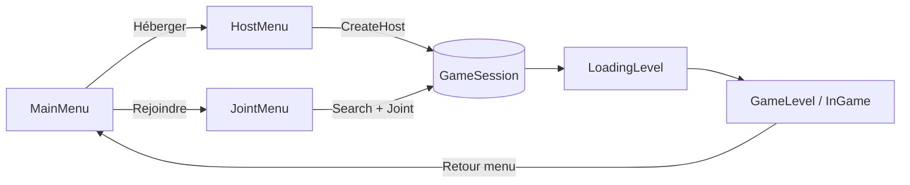

# MultiPlayerTemplate 🔗🎮

**Modèle de projet multijoueur pour Unreal Engine 5.4** — un template C++ complet et prêt à l'emploi qui couvre l'ensemble du cycle multijoueur : hébergement et recherche de sessions, menus (Main Menu / Host / Join), écrans de chargement, personnage FPS/TPS, HUD piloté par machine à états, et un exemple de gameplay coopératif (puzzle).

> 🧠 **TL;DR** : clonez le repo, ouvrez le `.uproject` avec UE 5.4, compilez, et vous avez une base multijoueur fonctionnelle avec sessions, menus et personnage jouable — sur laquelle construire votre jeu.

---

## 📋 Sommaire

- [Aperçu](#-aperçu)
- [Fonctionnalités](#-fonctionnalités)
- [Architecture du projet](#-architecture-du-projet)
- [Système de sessions en ligne](#-système-de-sessions-en-ligne)
- [Personnage &amp; contrôles](#-personnage--contrôles)
- [Interface utilisateur (HUD &amp; menus)](#-interface-utilisateur-hud--menus)
- [Niveaux](#-niveaux)
- [Exemple de gameplay : puzzle coopératif](#-exemple-de-gameplay--puzzle-coopératif)
- [Installation](#-installation)
- [Configuration](#-configuration)
- [Roadmap / limites actuelles](#-roadmap--limites-actuelles)
- [Licence](#-licence)

---

## 🎯 Aperçu

`MultiPlayerTemplate` est un projet **Unreal Engine 5.4** en **C++** (module runtime `MultiPlayerTemplate`) qui sert de point de départ pour tout jeu multijoueur. Il implémente :

- la **création / recherche / destruction / rejoignement de sessions** via l'API OnlineSubsystem (NULL par défaut, EOS prêt à activer) ;
- un **flux d'interface complet** : MainMenu → HostMenu / JointMenu → Loading → InGame, piloté par une machine à états (`EGameStateType`) ;
- un **personnage de base** commutant entre vue FPS, TPS ou hybride (FTPS), avec Enhanced Input ;
- un **exemple d'interaction réseau** : un puzzle cube interactif avec RPC serveur (`ServerInteract`) ;
- un **HUD dynamique** instanciant le bon widget selon l'état du jeu.

Le projet utilise le Starter Content (chargé via `StartupActions` dans `DefaultGame.ini`) et cible **Windows (DX12, SM6)** et **Linux (Vulkan SM6)**, avec Lumen et Virtual Shadow Maps activés.

---

## ✨ Fonctionnalités


| Domaine        | Détail                                                                       |
| -------------- | ---------------------------------------------------------------------------- |
| 🌐 Sessions    | Host / Find / Join / Destroy via `AMPT_GameSession` (OnlineSubsystem)        |
| 🕹️ Entrées    | Enhanced Input (`IMC_Default`, `IMC_Weapons`), manette &amp; souris          |
| 👤 Personnage  | FPS / TPS / FTPS, sprint, zoom caméra, saut, tir                             |
| 🩸 Santé (RPC) | `ServerTakeDamage` + `OnHealthUpdate`, réplication                           |
| 🧩 Interaction | Interface `IMPT_Interactable` + RPC `ServerInteract`                         |
| 🖥️ UI         | Widgets C++/WBP : MainMenu, Host, Join, Loading, InGame, lignes de résultats |
| 🗺️ Niveaux    | DataTable pilotée (`DT_Levels`) : sélecteur de carte dans le menu Host       |
| 🎥 Rendu       | Lumen (Dynamic GI), réflexions Lumen, Virtual Shadow Maps, DX12/Vulkan SM6   |


---

## 🏗️ Architecture du projet

```text
MultiPlayerTemplate/
├── Config/
│   ├── DefaultEngine.ini      # Maps par défaut, GameMode, GameInstance, rendu (Lumen, SM6)
│   ├── DefaultGame.ini        # ProjectID + chargement du StarterContent
│   └── DefaultInput.ini       # Réglages d'axes / Enhanced Input
├── Content/
│   ├── Assets/               # AnimStarterPack, personnages, FP arms, prototypes
│   ├── Blueprint/            # BP_BaseCharacter, BP_PuzzleCharacterExemple, BP_GameMode, BP_GameInstance
│   ├── Data/                 # DT_Levels (infos de niveaux : nom, référence, pawn par défaut)
│   ├── Inputs/               # IMC_Default, IMC_Weapons, Input Actions
│   ├── Levels/               # MainMenu, FirstLevel, LoadingLevel, FightLevel, PuzzleLevel, TestLevel
│   ├── UI/                   # WB_MainMenu, WB_HostMenu, WB_JointMenu, WB_LoadingScreen, ...
│   └── StarterContent/
└── Source/MultiPlayerTemplate/
    ├── Public/ & Private/
    │   ├── Characters/        # MPT_BaseCharacter, MPT_PuzzleCharacterExemple
    │   ├── PlayerControllers/ # MPT_PlayerController (Input Mapping Context)
    │   ├── Puzzle/            # MPT_Interactable (interface), MPT_PuzzleCube
    │   ├── System/            # MPT_GameInstance, MPT_GameSession, MPT_GameModeBase, MPT_PlayerState
    │   ├── UI/                # MPT_HUDSystem + widgets de menus
    │   ├── Enums/             # EGameStateType, ECharacterVueType
    │   ├── Structs/           # FMPT_LevelInfos, FMPT_SessionInfos, FMPT_PlayerPawnData
    │   └── levels/            # Level Script Actors : GameLevel, LoadingLevel, MainMenuLevel
    ├── MultiPlayerTemplate.Build.cs
    ├── MultiPlayerTemplate.Target.cs        # Cible Game
    └── MultiPlayerTemplateEditor.Target.cs  # Cible Editor
```

### Flux général



Le HUD (`AMPT_HUDSystem`) écoute les changements d'état (`EGameStateType`: `MainMenu`, `HostMenu`, `JointMenu`, `Loading`, `InGame`) et instancie le widget correspondant depuis une `TMap<EGameStateType, TSubclassOf<UUserWidget>>` — chaque menu est donc découplé du flux de jeu.

---

## 🌐 Système de sessions en ligne

Le cœur multijoueur est réparti entre trois classes :

- **`UMPT_GameInstance`** — propriétaire du système réseau. Elle crée et garde une référence à l'`AMPT_GameSession` (`GetNetworkSystem()`) et expose la DataTable `LevelInfos` utilisée par le menu Host pour lister les cartes.
- **`AMPT_GameSession`** (dérivé de `AGameSession`) — encapsule l'API OnlineSubsystem :
  - `HostSession(...)` — création de session (nom, carte, LAN, présence, nb max de joueurs) avec delegates `OnCreateSessionComplete` / `OnStartOnlineGameComplete` ;
  - `FindSessions(...)` — recherche asynchrone, notifiée via l'événement `FFindSessionEvent EventAfterFindigSession` (auquel le JointMenu s'abonne) ;
  - `JoinSession(...)` — rejoindre un résultat de recherche, avec `OnJoinSessionComplete` ;
  - `OnDestroySessionComplete(...)` — nettoyage de session.
- **`FMPT_SessionInfos`** — structure passée entre le menu et les lignes de résultats (nom de session + `FOnlineSessionSearchResult`).

**Backend en ligne** : le projet lie `OnlineSubsystem`, `OnlineSubsystemUtils`, `OnlineServicesEOS` et `OnlineServicesNull`. Le `DefaultEngine.ini` active `OnlineSubsystem` avec `DefaultPlatformService=Null` (sessions LAN/Null par défaut), et les blocs `OnlineServices` / `OnlineEngineInterface` (EOS V2) sont présents mais commentés — passez à EOS en les décommentant et en configurant vos identifiants.

### Menu Host (`UMPT_HostMenu`)

Paramètres configurables dans l'UI : nom de session, carte (sélection via `DT_Levels` : `NextMap`/`PreviousMap`), nb de joueurs max (`MorePlayer`/`LessPlayer`, défaut 32), LAN, présence. `CreateHost()` déclenche la session et l'écran de chargement.

### Menu Join (`UMPT_JointMenu`)

`Search()` lance la recherche de sessions (filtres nom / LAN / présence), les résultats sont instanciés dynamiquement comme `UMPT_SearchResultLine` (nom, joueurs connectés, nb max) ; la sélection puis `Joint()` rejoignent la session via le GameSession.

---

## 👤 Personnage &amp; contrôles

**`AMPT_BaseCharacter`** (config = Game) :

- **Caméras** : `SpringArm + ThirdPersonCamera`, `FirstPersonCamera`, `FirstPersonMesh` (bras). Vue pilotée par `ECharacterVueType` (`FPS`, `TPS`, `FTPS`) et `SwitchCameraPointOfView()`, avec zoom caméra borné (`m_ArmLengthMin/Max`).
- **Mouvement** : Enhanced Input (`MoveAction`, `LookAction`, `JumpAction`, `SprintAction`, `ZoomAction`, `FireInput`) avec gestion FPS/TPS distincte (`FPSMove`/`TPSMove`), sprint par coefficient de vitesse (`m_SprintSpeedCoef`).
- **Réplication** : `GetLifetimeReplicatedProps` surchargé ; santé gérée côté serveur :
  - `ServerTakeDamage(float)` — RPC `Server, Reliable, WithValidation` ;
  - `OnHealthUpdate()` — mise à jour + destruction à épuisement (santé actuellement commentée, squelette prêt).

**`AMPT_PlayerController`** — applique l'`InputMappingContext` Enhanced Input au `BeginPlay`.

**`AMPT_PuzzleCharacterExemple`** (voir [Puzzle](#-exemple-de-gameplay--puzzle-coopératif)) — ajoute une action d'interaction + RPC serveur.

---

## 🖥️ Interface utilisateur (HUD &amp; menus)


| Classe                  | Rôle                                                                                       |
| ----------------------- | ------------------------------------------------------------------------------------------ |
| `AMPT_HUDSystem`        | AHUD étatique : mappe `EGameStateType → WidgetClass`, instancie et affiche le widget actif |
| `UMPT_MainMenu`         | Boutons : héberger (`OpenHostMenu`), rejoindre (`OpenJoinMenu`), quitter (`Quit`)          |
| `UMPT_HostMenu`         | Configuration de session (carte, joueurs max, LAN, présence) + `CreateHost`                |
| `UMPT_JointMenu`        | Recherche de sessions, liste dynamique de résultats, `Joint()`                             |
| `UMPT_SearchResultLine` | Ligne de résultat : nom de session, joueurs connectés/max, `OnClickAction` → sélection     |
| `UMPT_LoadingPopup`     | Popup de chargement pendant les opérations réseau                                          |
| `UMPT_InGameScreen`     | Écran en jeu (menu via `UScaleBox`)                                                        |


Tous les widgets C++ont leur counterpart Blueprint (`WB_*`) pour le visuel — logique en C++, layout en WBP.

---

## 🗺️ Niveaux


| Niveau                     | Rôle                   | Level Script Actor   |
| -------------------------- | ---------------------- | -------------------- |
| `MainMenu`                 | Écran d'accueil        | `AMPT_MainMenuLevel` |
| `LoadingLevel`             | Écran de chargement    | `AMPT_LoadingLevel`  |
| `FirstLevel`               | Premier niveau de test | `AMPT_GameLevel`     |
| `FightLevel` / `TestLevel` | Levels de jeu          | `AMPT_GameLevel`     |
| `PuzzleLevel`              | Démonstration coop     | `AMPT_GameLevel`     |


La DataTable **`DT_Levels`** (`FMPT_LevelInfos` : nom, `TSoftObjectPtr<UWorld>`, `DefaultPawnClass`) alimente le sélecteur de cartes du HostMenu — ajouter une carte = ajouter une ligne dans la DataTable.

---

## 🧩 Exemple de gameplay : puzzle coopératif

Démontre le pattern d'interaction réseau recommandé :

1. `IMPT_Interactable` — interface avec `virtual void Interact(AActor*) = 0` ;
2. `AMPT_PuzzleCube` — acteur interactif (static mesh + racine) implémentant `Interact` ;
3. `AMPT_PuzzleCharacterExemple` — `TryInteract()` détecte la cible côté client, puis **`ServerInteract(AActor*)`** (RPC serveur reliable avec validation) applique l'interaction côté autoritaire.

C'est le squelette à réutiliser pour tout objet interactif multijoueur du projet.

---

## 🚀 Installation

**Prérequis** : Unreal Engine **5.4**, Visual Studio 2022 (workload *Game Development with C++*), Windows 10/11 (DX12) ou Linux (Vulkan).

```bash
git clone https://github.com/LepetitPortfolio/MultiPlayerTemplate.git
```

1. Ouvrez `MultiPlayerTemplate.uproject` — les fichiers de projet VS sont générés à l'ouverture.
2. Si un prompt propose de reconstruire, acceptez ; sinon : *File → Generate Visual Studio project files*, puis **Build** dans VS (config `Development Editor`, Win64).
3. Ouvrez l'éditeur — `EditorStartupMap` est `FirstLevel` ; le jeu lancé démarre sur `MainMenu` avec `BP_GameInstance` et `BP_GameMode`.

**Test multijoueur local** : *Play* → décochez "Run Under One Process" dans les options Play, lancez 2+ instances, hébergez depuis l'une et rejoignez depuis les autres (LAN activable dans le HostMenu).

## ⚙️ Configuration

- **EOS / Steam** : `OnlineSubsystem` est en `Null` par défaut. Le module lie déjà `OnlineServicesEOS` ; décommentez `[/Script/Engine.OnlineEngineInterface]` / `[OnlineServices]` dans `DefaultEngine.ini` et configurez le plugin correspondant.
- **Rendu** : Lumen (GI dynamique + réflexions), Virtual Shadow Maps, DX12 SM6 (Windows) et Vulkan SM6 (Linux) — définis dans `DefaultEngine.ini` (`RendererSettings`).
- **Ajouter une carte jouable** : ajoutez le niveau dans `Content/Levels`, créez une entrée dans `DT_Levels` (nom, référence, `DefaultPawnClass`), elle apparaît automatiquement dans le HostMenu.

## 🔭 Roadmap / limites actuelles

- Santé du personnage : logique RPC en place mais propriété `Health` répliquée commentée — à activer selon vos besoins.
- `MPT_GameModeBase` / `MPT_PlayerState` / `FMPT_PlayerPawnData` sont des squelettes prêts à étendre.
- Backend en ligne : NULL/LAN par défaut ; l'intégration EOS est préparée mais non configurée.

## 📄 Licence

Code de base généré par le template Epic Games (en-têtes "Copyright Epic Games, Inc.") — le reste du projet appartient à son auteur. Ajoutez ici votre licence (ex. MIT) avant toute redistribution.
